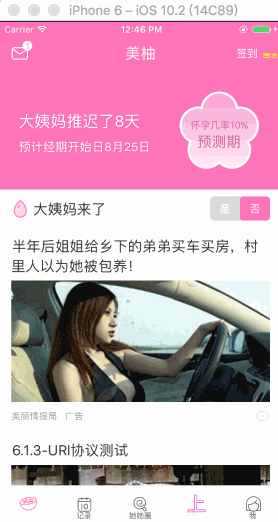

[TOC]

可视化埋点
  
  
# 1.无痕埋点介绍

## 支持任意视图的曝光和点击事件，无需关心具体逻辑

* 每个页面有个2秒的不曝光时间，用于过滤缓存数据，2秒后才进行曝光
* 为了演示，当曝光的时候，View会自动标红


## 并且支持自定义多少比例显示了 才算曝光，默认 0.1


## 支持曝光调试模式

当相应控件曝光的时候，会把它标红，这样就可以很明显的知道是否执行了曝光上报


## iOS 埋点用法

之前羊毛省钱代码


加入无痕埋点后的代码


```

// 基于业务id，设置唯一eventName，系统内部用于滤重
cell.imyut_eventInfo.eventName = [NSString stringWithFormat:@"ttq_home_%@", item.id];

// 设置附带的扩展参数，常见用法：把 URI跳转链接, 通过下述方法改为 扩展参数
cell.imyut_eventInfo.eventValue = [IMYGAEventHelper trimParamsWithRedirectUrl:redirect_url];
// 或者自定义
cell.imyut_eventInfo.eventValue = { "id" : item.id, "price" : item.price, "title" : item.title };

// 显示比例，不必须，默认 0.1
cell.imyut_eventInfo.showRadius = 0.3;

// 统计模式，不必须，是否重复曝光啦，曝光时长统计啦
cell.imyut_eventInfo.type = IMYUTExposureTypeTimeAndRepeat;

// 曝光回调，用于旧业务迁移使用
self.imyut_eventInfo.exposuredBlock = ^(__kindof UIView *view, NSDictionary *params) {
	NSLog(@"%@", params);
	// 给业务埋点发送数据
	[IMYGAEventHelper postWithPath:@"bi_information" params:@{@"业务埋点参数":@""} headers:nil completed:nil];       
};

// 已曝光状态，是否能被移除。主要用于下拉刷新等，重置曝光状态。 默认：NO
cell.imyut_eventInfo.ableToClean = YES;

/**
 *  清除该页面已曝光的eventNames，一般在 下拉刷新 等情况下使用
 *  只会清除 ableToClean 属性为 YES 的数据。
 */
@interface UIViewController (IMYUTExposuredIds)
- (void)imyut_cleanExposuredIds;
@end

```

上报参数格式：


## Android 埋点用法


#### Android曝光view调用方式:

```

 MeetyouBiAgent.onEvent(view, MeetyouBiConfig.newBuilder()
                .withActivity(activity)                       //view 属于的activity，为保证数据的准确性，请传递，若不传，则使用顶级activity;内部不会持有
                .withFragment(fragment)                       //view 属于的fragment，为保证数据的准确性，对应一个activity多个fragment的情况，请务必传递；内部不会持有
                .withEventname("news_id")                     //eventName，请保证唯一性
                .withDatamap(map)                             //自定义数据，可使用MeetyouBiUtil.parseDataMap(redirect_url)来转换
                .withListener(listenr)                        //曝光的时候会调用这个listener;
                .withPosition(position)                       //列表的第几项，默认为0
                .withPrecent(0.1f)                            //超过十分之一就曝光,默认0.1
                .withType(MeetyouBiType.TYPE_EXPOSURE_UNIQUE) //参见MeetyouBiType，默认为0；
                .withAbleClean(false)                         //是否允许清除曝光记录，默认为false；

                /**
                 TYPE_EXPOSURE_UNIQUE（0） : 曝光一次，不可见->可见，走曝光回调
                 TYPE_EXPOSURE_REPEAT(1) : 重复曝光，不可见->可见，走曝光回调
                 TYPE_EXPOSURE_UNIQUE_AND_TIME(2) : 曝光一次，可见->不可见，走曝光回调
                 TYPE_EXPOSURE_REPEAT_AND_TIME(3) : 重复曝光，可见->不可见，走曝光回调
                 TYPE_EXPOSURE_REAL_TIME(4) : 按照TYPE_EXPOSURE_REPEAT_AND_TIME上报，可见、不可见都要走曝光回调
                 */

                .build()
        );

        /**
         * 清除某页面下的已曝光的View记录；
         * object：必须是withActivity或者withFragment里的对应的值；
         */
        MeetyouBiAgent.cleanExposuredView(object);
        
```


# 2. 源码解析

就直接来看 setEventName： 

```
- (void)setEventName:(NSString *const)eventName {
if ([_eventName isEqualToString:eventName]) {
return;
}
// 判断旧曝光状态是否需要终止
[self fixVisibleStatus];
// 重置相关属性
_eventName = [eventName copy];
[self reset];
// 开始监听
if (eventName != nil) {
[IMYUTExposureTrackManager listenExposureForView:self.view];
}
}
```

`[IMYUTExposureTrackManager listenExposureForView]` 放到下次主线程还监听，是因为 比如在 `cellForIndexpath` 方法中，这时候不一定有加到 window 上，为了减少一次循环，就放到下个主线程中


```

+ (void)listenExposureForView:(UIView *)view {
if (!view) {
return;
}
imy_asyncMainBlock(^{
[[self sharedInstance] _listenExposureForView:view];
});
}

- (void)_listenExposureForView:(UIView *)view {
// 已加到监听列表中
if ([_listenViews containsObject:view]) {
return;
}
// 尝试曝光
BOOL isFinished = [self exposureViewFinished:view];
if (isFinished) {
// 已结束监听， 无需添加到列表中
return;
}

if (view.window) {
// 已在视图中, 加到 监听 数组中
[_listenViews addObject:view];
_shouldRunning = YES;
}
}

```
先说为什么只有 在window 中的才需要加入监听数组中，减少待循环的views

```
@implementation UIView (IMYUTPublic)

+ (void)load {
imy_load_main(IMYLoadAtPreMain, ^{
[UIView imy_swizzleMethod:@selector(didMoveToWindow) withMethod:@selector(imyut_didMoveToWindow) error:nil];
});
}

- (void)imyut_didMoveToWindow {
/// 执行原方法
[self imyut_didMoveToWindow];
/// 执行曝光检测
BOOL hasListener = objc_getAssociatedObject(self, @selector(imyut_eventInfo));
if (hasListener && self.imyut_eventInfo.eventName) {
[IMYUTExposureTrackManager runloopForView:self];
}
}

@end

- (void)runloopForView:(UIView *)view {
if (view.window) {
// 加入到 检测队列
if (![_listenViews containsObject:view]) {
[_listenViews addObject:view];
_shouldRunning = YES;
[self runloop];
}
}
}


```

优化 runloop 

用户触摸，待监听的 view 加到 window 中，ViewController 2秒等待期结束

```

@implementation UIApplication (IMYUTInterception)

- (void)imyut_sendEvent:(UIEvent *)event {
[self imyut_sendEvent:event];
if (event.type == UIEventTypeTouches) {
// 只有当用户触摸时，才唤起曝光检测
[IMYUTExposureTrackManager runloop];
}
}

@end

- (void)runloop {
// 主循环还不能启动，等应用启动3秒后，再跑
if (!_mainRunning) {
return;
}
// 没控件需要监听
if (!_shouldRunning) {
return;
}
// 更新最后一次用户操作时间
_lastRunningTime = CACurrentMediaTime();
if (_isRunning) {
return;
}
_isRunning = YES;

// 开始循环遍历
[self _runloop];
}

- (void)_runloop {
// 0.1 秒执行一次，曝光检测
imy_asyncMainBlock(0.1, ^{
// by iPhone7,
// 快速滑动时，平均一次 0.0003, => 0.2 毫秒，对性能损耗较小，
// 处于缓慢滑动时，平均一次 0.00008, => 0.1 毫秒以内，对性能损耗可以忽略不计，
[self _runloopAction];
});
}

- (void)_runloopAction {
if (_listenViews.count == 0) {
// 没有待监听控件，暂停循环
_shouldRunning = NO;
_isRunning = NO;
return;
}
NSArray *allObjects = _listenViews.allObjects;
for (UIView *view in allObjects) {
BOOL isFinished = [self exposureViewFinished:view];
if (isFinished) {
// 已结束监听， 无需添加到列表中
[_listenViews removeObject:view];
}
}
double diff = CACurrentMediaTime() - _lastRunningTime;
if (diff < 2) {
// 继续监听，有些惯性滚动
[self _runloop];
} else {
// 用户没操作2秒了，大部分滚动也停止了， 所以先暂停监听
_isRunning = NO;
}
}

```

## 核心代码，判断各种曝光情况

```

- (BOOL)exposureViewFinished:(UIView *)view {
if (!view) {
return YES;
}
IMYUTEventInfo *eventInfo = view.imyut_eventInfo;
if (!eventInfo.eventName) {
NSAssert(NO, @"eventName is nil !");
return YES;
}
BOOL canExposure = YES;
// 获取父视图控制器
UIViewController<IMYViewControllerProtocol> *parentPage = view.imyut_viewController.obj;
// 获取父视图 曝光信息
IMYUTExposureStatus *pageStatus = [parentPage imyut_exposureStatus];
if (eventInfo.inParentVC) {
/// parent vc 都不支持 isViewActived 方法
if (![parentPage respondsToSelector:@selector(isViewActived)]) {
NSAssert(NO, @"parent vc not extends IMYPublicBaseViewController !");
return YES;
}
/// VC 还处于不可曝光阶段，则不进行曝光
if (!pageStatus.isActived || !parentPage.isViewActived) {
canExposure = NO;
}
}

BOOL isFinished = NO;
const IMYUTExposureType exposureType = eventInfo.type;
NSString *eventName = eventInfo.eventName;
NSMutableSet *exposuredIds = pageStatus.exposuredIds;
NSMutableSet *showingIds = pageStatus.showingIds;

if (exposureType == IMYUTExposureTypeUnique || exposureType == IMYUTExposureTypeTimeAndUnique) {
/// 已曝光
if ([exposuredIds containsObject:eventName]) {
return YES;
}
}

// 判断 View 是否在可见区域内
if (canExposure && [self isVisibleForView:view showRadius:eventInfo.showRadius]) {
// 如果是标准统计，只需曝光一次即可
if (exposureType == IMYUTExposureTypeUnique) {
// 终止监听 & 曝光完成
isFinished = YES;
[exposuredIds addObject:eventName];
// 上报统计
[self trackExposureEventWithView:view parentPage:parentPage eventInfo:eventInfo upload:YES];
} else {
// 不是标准模式 & 不可见 => 可见
if (![showingIds containsObject:eventName]) {
[showingIds addObject:eventName];
[eventInfo beginVisible];
if (exposureType == IMYUTExposureTypeRepeat || exposureType == IMYUTExposureTypeReal) {
// 只有 Repeat 才要上报到 无痕埋点，如果是 Real 模式，不上报到无痕埋点，但是要给外部回调
BOOL upload = (exposureType == IMYUTExposureTypeRepeat);
[self trackExposureEventWithView:view parentPage:parentPage eventInfo:eventInfo upload:upload];
}
}
}
} else {
// 可见 => 不可见
if ([showingIds containsObject:eventName]) {
[eventInfo endVisible];
[showingIds removeObject:eventName];
if (exposureType == IMYUTExposureTypeTimeAndUnique) {
// 终止监听 & 曝光完成
isFinished = YES;
[exposuredIds addObject:eventName];
}
if (exposureType != IMYUTExposureTypeRepeat) {
// 上报统计
[self trackExposureEventWithView:view parentPage:parentPage eventInfo:eventInfo upload:YES];
}
}
// 如果不在 window 上，则不继续监听
if (!view.window) {
isFinished = YES;
}
}
return isFinished;
}

// 返回当前视图是否可见，超过多少百分比 才算曝光 [0,1]
- (BOOL)isVisibleForView:(UIView *)view showRadius:(CGFloat)showRadius {
UIWindow *inWindow = view.window;
if (!inWindow || view.isHidden || view.alpha < 0.01) {
return NO;
}
CGRect rectInWindow = CGRectIntegral([view convertRect:view.bounds toView:inWindow]);
CGRect windowBox = CGRectIntegral(inWindow.bounds);

NSInteger widthDiff = rectInWindow.size.width * showRadius;
NSInteger heightDiff = rectInWindow.size.height * showRadius;

/// 相交不算是可见
BOOL isVisibled = (CGRectGetMinY(rectInWindow) < CGRectGetMaxY(windowBox) - heightDiff &&
CGRectGetMaxY(rectInWindow) > CGRectGetMinY(windowBox) + heightDiff &&
CGRectGetMaxX(rectInWindow) > CGRectGetMinX(windowBox) + widthDiff &&
CGRectGetMinX(rectInWindow) < CGRectGetMaxX(windowBox) - widthDiff);
return isVisibled;
}

```


